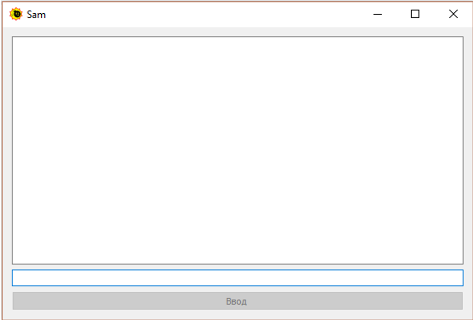
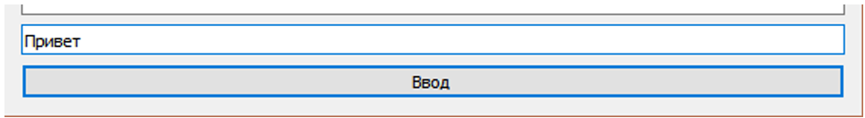
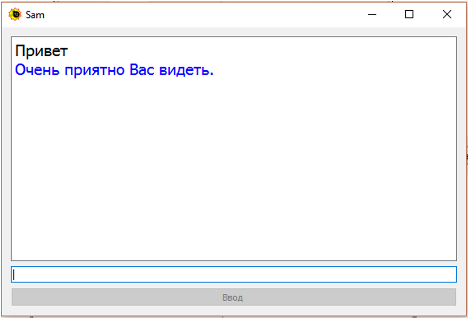

# Chat-bot-Sam
Чат-бот, имитирующий разговор человека и компьютера. Программа анализирует введённую фразу пользователя и подбирает подходящий ответ из имеющегося текстового файла, если подходящий ответ не найден, то программа выдает случайным образом «универсальные» ответы из другого текстового файла, который содержит данные ответы.

____
## Описание интерфейса программы
Окно для ввода исходных данных и вывода результата    
  

Ввод пустой строки невозможен, так как кнопка ввода будет не активна и нажать на неё у пользователя не получится.  
 

При вводе какого либо символа или строки, кнопка становится активной и на неё можно нажать левой клавишей мыши либо кнопкой Enter.  
 

При нажатии на кнопку ввода левой клавишей мыши либо кнопки Enter в поле вывода данных появляется строка, которую ввёл пользователь, ниже другим цветом отображается ответ программы на введённую пользователем строку. В поле ввода стираются введённые данные, кнопка вновь становится не активной.  
  

Пример работы программы ниже:  

